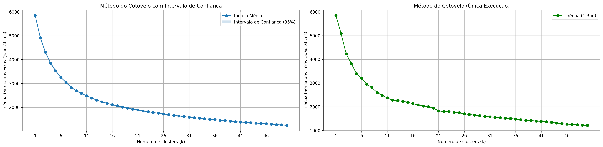

# K-Means Clustering - Obesity Dataset

Este projeto aplica o algoritmo de K-Means para realizar agrupamento no Obesity Dataset, que contém informações pessoais e de estilo de vida com o objetivo de classificar o tipo de obesidade do indivíduo (variável alvo: `NObeyesdad`).

---
## Sobre o Dataset
O conjunto de dados Estimation of Obesity Levels Based on Eating Habits and Physical Condition foi desenvolvido para estimar os níveis de obesidade em indivíduos com base em seus hábitos alimentares e condição física. Ele contém 2.111 registros e 17 atributos, abrangendo informações demográficas, hábitos alimentares, atividades físicas e outras variáveis relacionadas ao estilo de vida.

- Origem dos Dados:

  - Coleta: 23% dos dados foram coletados diretamente de usuários por meio de uma plataforma web, enquanto 77% foram gerados sinteticamente utilizando a ferramenta Weka e o filtro SMOTE para balancear as classes.
  - Localização: Os dados foram obtidos de indivíduos residentes no México, Peru e Colômbia.

Atributos do Dataset

Os principais atributos incluem:

  - Demográficos:
    - Gender: Gênero do indivíduo (Masculino/Feminino).
    - Age: Idade.
    - Height: Altura em metros.
    - Weight: Peso em quilogramas.

  - Hábitos Alimentares:
    - FAVC: Consumo frequente de alimentos calóricos.
    - FCVC: Frequência de consumo de vegetais.
    - NCP: Número de refeições principais por dia.
    - CAEC: Consumo de alimentos entre as refeições.
    - CH2O: Consumo diário de água.
    - CALC: Frequência de consumo de álcool.

  - Condição Física e Estilo de Vida:
    - SCC: Monitoramento do consumo de calorias.
    - FAF: Frequência de atividade física.
    - TUE: Tempo de uso de dispositivos tecnológicos.
    - MTRANS: Meio de transporte utilizado.
    - SMOKE: Hábito de fumar.

  - Histórico Familiar:
    - family_history_with_overweight: Histórico familiar de sobrepeso.

  - Variável Alvo:
    - NObeyesdad: Nível de obesidade, categorizado em:
      - Insufficient Weight
      - Normal Weight
      - Overweight Level I
      - Overweight Level II
      - Obesity Type I
      - Obesity Type II
      - Obesity Type III

## Aplicações

Este dataset é amplamente utilizado em tarefas de classificação, regressão e agrupamento, sendo ideal para desenvolver modelos preditivos relacionados à saúde e ao bem-estar.

## Pré-processamento

Antes de aplicar o K-Means, foi necessário transformar as variáveis categóricas usando One-Hot Encoding, além de remover a variável alvo para evitar viés no agrupamento.
```python
columns_cat = [
  'Gender', 'family_history_with_overweight', 'FAVC', 'CAEC',
  'SMOKE', 'SCC', 'CALC', 'MTRANS'
]
columns_num = X.columns.difference(columns_cat).difference(['NObeyesdad'])

transformer_x = CompositeTransformer(
  numeric_features=columns_num,
  categorical_features=columns_cat
)
X_transformed = transformer_x.transform(X)

transformer_y = CompositeTransformer(
  numeric_features=[],
  categorical_features=['NObeyesdad']
)
y_transformed = transformer_y.transform(y)
```

## Treinamento com K-Means

Como o número de classes em NObeyesdad é conhecido (7 categorias), utilizamos n_clusters=7.

```python
from sklearn.cluster import KMeans

kmeans = KMeans(n_clusters=7, random_state=0, n_init="auto")
kmeans.fit(X)

labels = kmeans.labels_
```

## Validação com Análise Exploratória

Para validar a escolha de 7 clusters, aplicamos o Método do Cotovelo (Elbow Method):
  - Rodamos o K-Means de 1 a 50 clusters, repetido 30 vezes.
  - Utilizamos bootstrap para estimar a média dos valores de inércia.
  - Geramos o intervalo de confiança de 95% usando percentis (α = 0.05).
  - Criamos dois plots:
    - Um com o intervalo de confiança para cada número de clusters.
    - Outro com uma única execução do K-Means.



A análise mostra que o número ideal de clusters converge para 7, validando nossa hipótese.

## Conclusão

Este projeto demonstra como o K-Means pode ser utilizado para identificar padrões em dados relacionados à saúde mesmo sem supervisão direta. O número de clusters obtido (7) é coerente com as classes reais de obesidade, evidenciando a eficácia da abordagem.
## Referências

- [UCI Machine Learning Repository: Estimation of Obesity Levels Based On Eating Habits and Physical Condition](https://archive.ics.uci.edu/ml/datasets/Estimation+of+obesity+levels+based+on+eating+habits+and+physical+condition)

